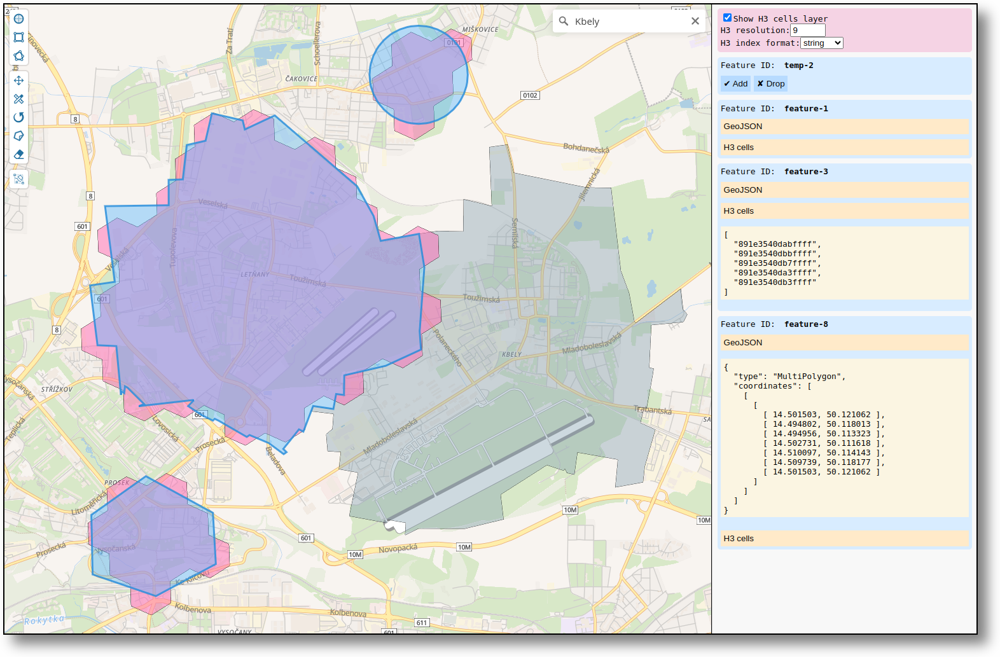

# Geoman H3

[![CI workflow status][badge]][actions]

[badge]: https://github.com/tlinhart/geoman-h3/actions/workflows/ci.yml/badge.svg
[actions]: https://github.com/tlinhart/geoman-h3/actions

Geoman and H3 library demo. It's built with TypeScript and React and uses Vite
as a build tool.



## Usage

Start by cloning the repository and installing the dependencies:

```sh
git clone https://github.com/tlinhart/geoman-h3.git
cd geoman-h3
nvm install
npm install
```

### Development Server

To start the development server, run

```sh
npm run dev
```

and open the browser at http://localhost:5173. It has hot module replacement
(HMR) enabled and uses a Vite plugin to automatically check the code with
TypeScript and Biome.

### Production Build

To build the application for production, run

```sh
npm run build
```

To test the production build, run

```sh
npm run preview
```

and point the browser to http://localhost:4173.

### Formatting, Linting and Type Checking

To format and lint the files with Biome, issue

```sh
npm run biome
```

To type check the code with TypeScript, run

```sh
npm run typecheck
```

## Demo

There is a demo of the application available at
http://geoman-h3-demo.linhart.tech. The whole stack is managed with Pulumi IaC
and deployed using GitHub Actions.
